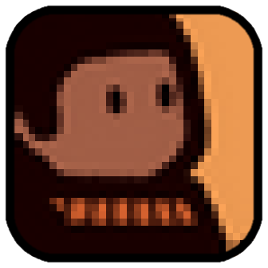

# RUN Mod (game stuff port)

aa proj to port some stuff of one game (ui and resources) to geometry dash



## sooo ye aa an A original game used for mod

Is a **RUN ALPHA 1.2 WINDOWS** that i got on [itch page](https://lateamrun.itch.io/run-the-world-in-between#demo)

### [RUN: The world in-between by LaTeamRun](https://lateamrun.itch.io/run-the-world-in-between)

```js
 Development: Hephep 
 Music: Thomas Barrandon 
 SFX: Louise Jeanson 
 Graphics: EncreMecanique
 QA: Sorghal
 PR: Mellyfroggy
```

got revesed by [GDRE tools](https://github.com/bruvzg/gdsdecomp) `v0.6.2`